# Portfolio Opdracht 2

## Inhoudsopgave

### Opdracht 1 - Docker basis en Swarm
1. [Voorbereiding](#1-voorbereiding)
2. [Les 4 - Docker installatie en basiscontrole](#2-les-4---docker-installatie-en-basiscontrole)
3. [Les 7 - Dockerfile, image build en container](#3-les-7---dockerfile-image-build-en-container)
4. [Les 8 - Docker Compose stack](#4-les-8---docker-compose-stack)
5. [Les 9 - Docker Swarm](#5-les-9---docker-swarm)
6. [Extra - Geautomatiseerd uitvoeren via Ansible](#6-extra---geautomatiseerd-uitvoeren-via-ansible)
7. [Basic Docker Networking](#7-basic-docker-networking)

### Opdracht 2 - MySQL containers in aparte subnetten
8. [MySQL containers in aparte subnetten](#8-mysql-containers-in-aparte-subnetten)

---

## Opdracht 1 - Docker basis en Swarm

---

## 1. Voorbereiding

Voor deze opdracht zijn drie Docker-VM's gebruikt, verdeeld over de drie Proxmox-nodes:
- docker-mgr-1 (10.24.40.22)
- docker-mgr-2 (10.24.40.24)
- docker-mgr-3 (10.24.40.26)

De extra WordPress-VM's uit Opdracht 1 zijn hergebruikt als Docker-hosts.

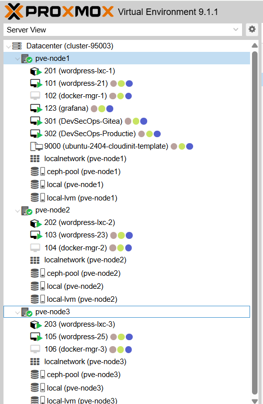

---

## 2. Les 4 - Docker installatie en basiscontrole

### Doel

Docker installeren op de hosts en controleren dat Docker correct werkt.

### Uitvoering

- Docker geïnstalleerd.
- Docker versie gecontroleerd.
- Basiscontainer getest met hello-world.
- Containers en images gecontroleerd met docker ps en docker images.

### Bewijs


---

## 3. Les 7 - Dockerfile, image build en container

### Doel

Een Docker image bouwen met een Dockerfile en daarin een container starten.

### Uitvoering

- Dockerfile aangemaakt op VM1.
- Image gebouwd met docker build.
- Nieuwe container gestart met docker run.
- Dezelfde werkwijze herhaald op VM2 en VM3.

### Bewijs

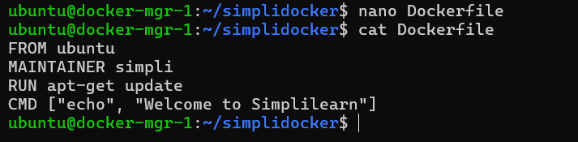

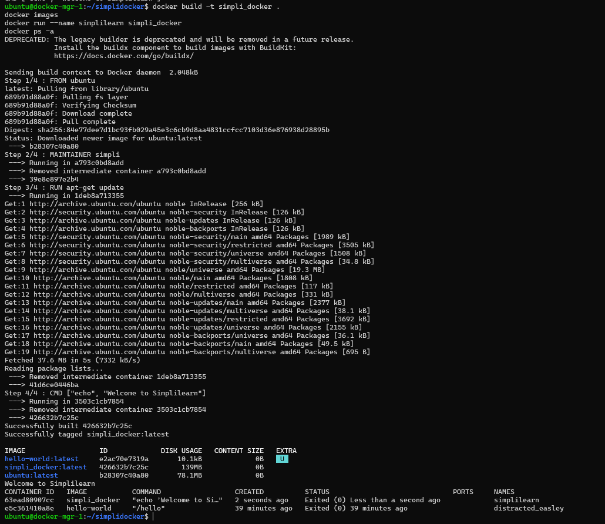

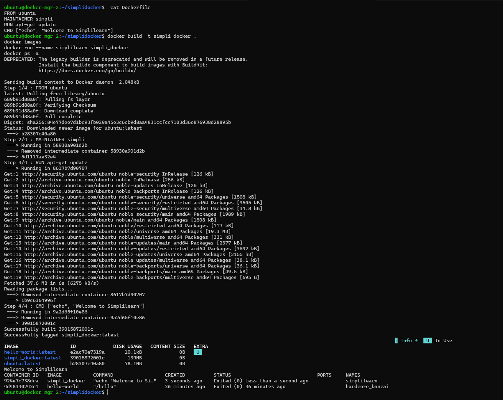

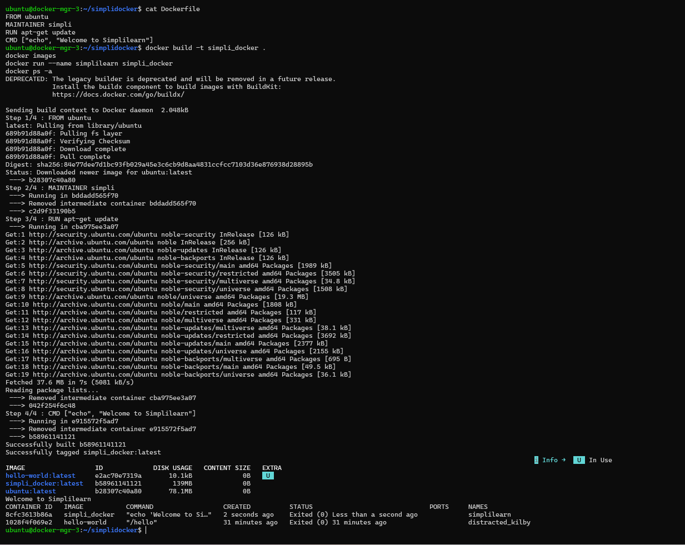

---

## 4. Les 8 - Docker Compose stack

### Doel

Een multi-container stack draaien met Docker Compose.

### Uitvoering

- docker-compose.yml aangemaakt.
- Stack gestart met docker compose up -d.
- Controle uitgevoerd met docker ps en docker compose logs.
- Herhaald op alle drie Docker-hosts.

### Bewijs

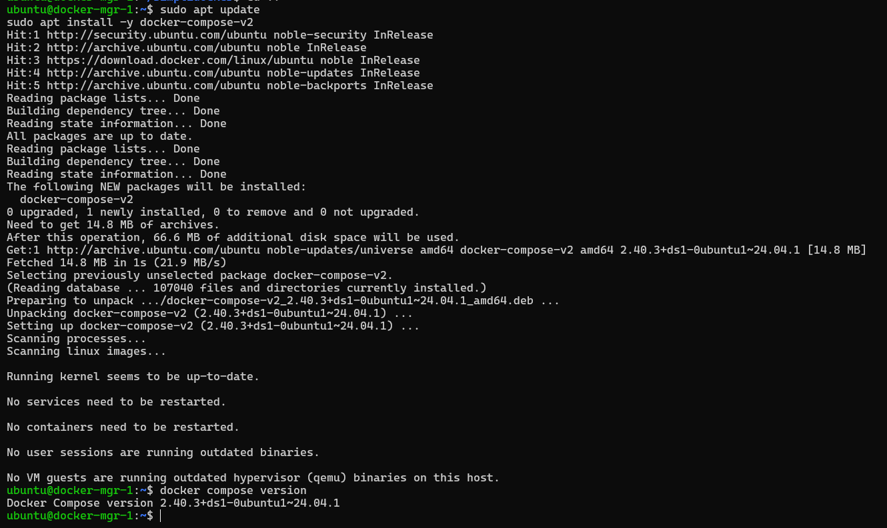

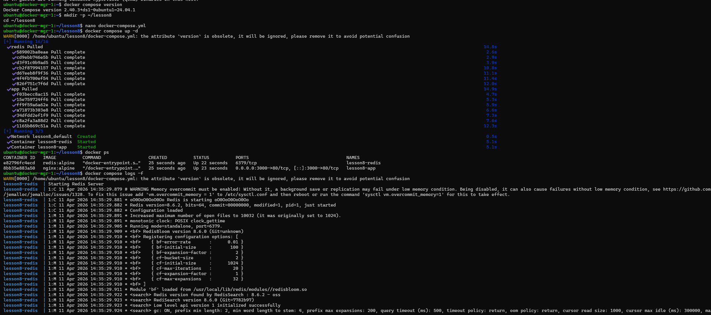

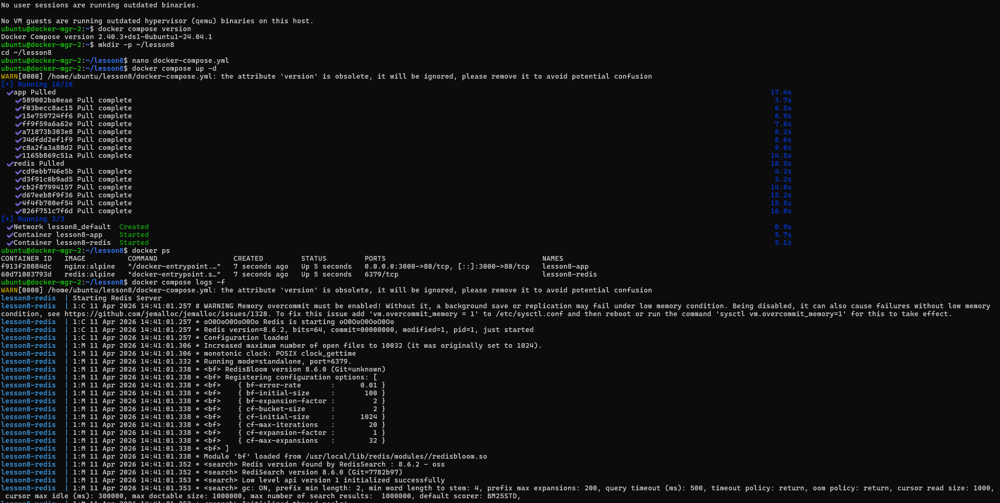

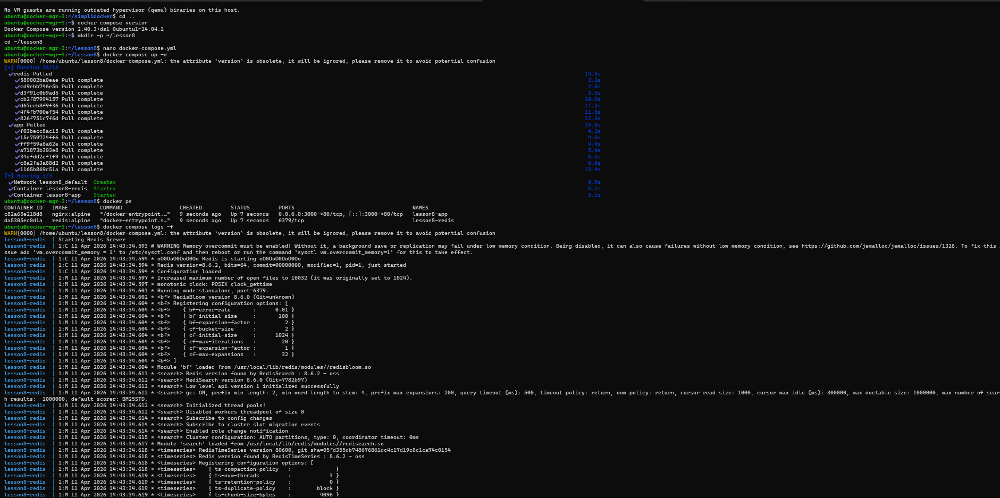

---

## 5. Les 9 - Docker Swarm

### Doel

Een swarmcluster opzetten met 3 managers (1 per Proxmox-node).

### Uitvoering

- Swarm geïnitialiseerd op docker-mgr-1.
- docker-mgr-2 en docker-mgr-3 toegevoegd als manager.
- Clusterstatus gecontroleerd met docker node ls.

### Bewijs

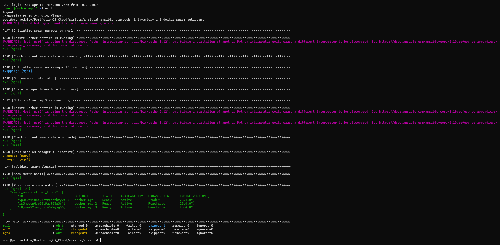

---

## 6. Extra - Geautomatiseerd uitvoeren via Ansible

Vanaf de swarm-stap is de setup geautomatiseerd uitgevoerd met Ansible.

Gebruikte bestanden:
- `scripts/ansible/inventory.ini`
- `scripts/ansible/docker_swarm_setup.yml`

Playbook resultaat:
- mgr1 als leader
- mgr2 en mgr3 als reachable managers
- validatie via docker node ls in de playbook-output

---

## 7. Basic Docker Networking

### Doel

De basis Docker-netwerkcommando's uitvoeren via een script dat de commando's één voor één doorloopt.

### Uitvoering

- Script aangemaakt: `scripts/bash/docker_networking.sh`
- Bridge-netwerk aangemaakt en geïnspecteerd.
- Twee containers gestart op hetzelfde netwerk.
- Verbinding tussen containers getest met ping.
- Netwerk en containers opgeruimd.

### Bewijs

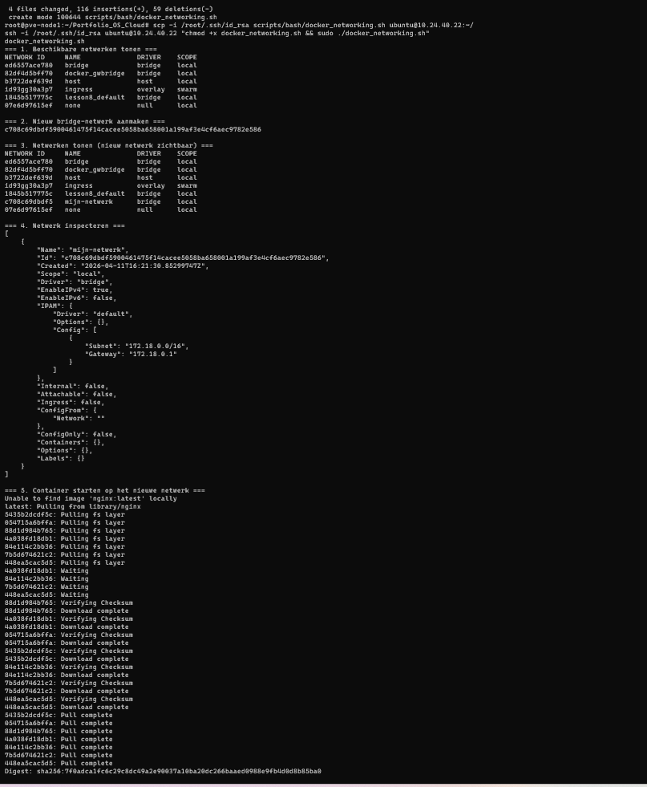

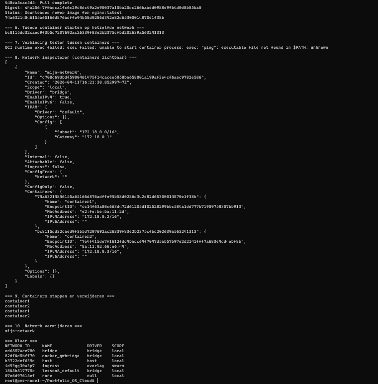

---

## Opdracht 2 - MySQL containers in aparte subnetten

---

## 8. MySQL containers in aparte subnetten

### Doel

Twee MySQL containers opstarten in aparte Docker-subnetten, de bereikbaarheid testen vanuit het Proxmox-subnet en tussen de containers onderling, en eventueel de connectiviteit herstellen.

### Docker subnetten uitgelegd

Docker maakt standaard één bridge-netwerk aan waarop alle containers met elkaar kunnen communiceren. Door containers in **aparte subnetten** te plaatsen, isoleer je ze van elkaar — ze kunnen dan niet meer zomaar onderling communiceren.

Dit is nuttig voor:
- **Beveiliging**: een database-container is niet bereikbaar vanuit een frontend-container tenzij je dat expliciet toestaat
- **Multi-tenant omgevingen**: meerdere klanten of applicaties delen dezelfde host maar zijn netwerktechnisch gescheiden
- **Microservices**: elke service heeft zijn eigen netwerksegment, waardoor blast radius bij een incident beperkt blijft

### Opzet

Twee MySQL containers in aparte subnetten via Docker Compose, beide op **docker-mgr-1 (10.24.40.22)**:

| Container | Subnet           | IP             | Gepubliceerde poort |
|-----------|------------------|----------------|---------------------|
| mysql1    | 192.168.100.0/24 | 192.168.100.10 | 3306                |
| mysql2    | 192.168.101.0/24 | 192.168.101.10 | 3307                |

Gebruikte bestanden:
- `scripts/docker/mysql-subnets/docker-compose.yml`
- `scripts/ansible/deploy_mysql_subnets.yml`

### Waarom één VM en niet drie?

Initieel is geprobeerd het playbook op alle drie Docker-managers (mgr1, mgr2, mgr3) uit te rollen. Dit leverde twee problemen op:

1. **Geen zinvolle netwerkseparatie** — als elke VM zijn eigen mysql1 en mysql2 krijgt, test je de isolatie drie keer op zichzelf. Containers op verschillende VM's communiceren sowieso via het host-netwerk (10.24.40.x), dus Docker bridge isolation is dan irrelevant.

2. **Complexe iptables-conflicten** — het playbook stopte Docker, manipuleerde iptables-chains handmatig en herstartte Docker. Dit veroorzaakte conflicten met de bestaande iptables-regels op de VM's en brak op een gegeven moment de SSH-verbinding naar de hosts.

De correcte aanpak voor Docker subnet-isolatie is: **beide containers op dezelfde host**, elk in een eigen Docker bridge network. De isolatie zit in de Docker lagen, niet in de VM-laag. Door alleen mgr1 te gebruiken is het playbook ook een stuk eenvoudiger en veiliger geworden.

### Uitvoering

De setup is geautomatiseerd via Ansible en uitgerold op docker-mgr-1:

```bash
ansible-playbook -i inventory.ini deploy_mysql_subnets.yml
```

1. Oude containers en netwerken opgeruimd
2. Docker Compose bestand gekopieerd naar de host
3. Containers gestart met `docker compose up -d`
4. Bereikbaarheid vanuit host getest op poorten 3306 en 3307 → **bereikbaar**
5. Connectiviteit tussen containers getest → **niet bereikbaar** (aparte Docker subnetten)
6. Fix toegepast: mysql1 toegevoegd aan subnet-b via `docker network connect`
7. Opnieuw getest → **bereikbaar**

### Bewijs

*Screenshots toevoegen na uitvoering.*
