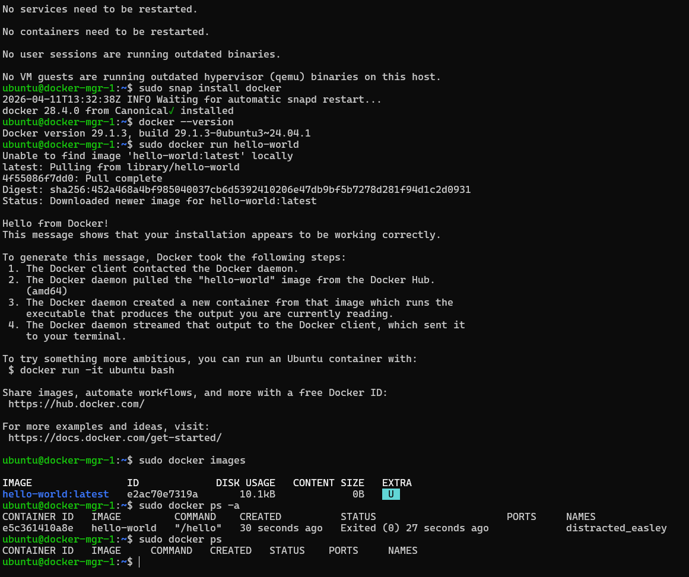

# Portfolio Opdracht 2

## Inhoudsopgave
1. [Tutorial en voorbereiding](#1-tutorial-en-voorbereiding)
2. [Les 4 - Installatie en basis Docker](#2-les-4---installatie-en-basis-docker)
3. [Les 7 - Build image with Dockerfile](#3-les-7---build-image-with-dockerfile)
4. [Les 8 - Docker Compose / containers op hosts](#4-les-8---docker-compose--containers-op-hosts)
5. [Les 9 - Swarm opzetten](#5-les-9---swarm-opzetten)
6. [Extra - Alle swarms via centrale manager](#6-extra---alle-swarms-via-centrale-manager)
7. [Basic Docker Networking](#7-basic-docker-networking)

---

## 1. Tutorial en voorbereiding

Voor Opdracht 2 volg ik de Docker tutorial stap voor stap. De opdracht is nog niet afgerond; dit document wordt per les aangevuld met de bijbehorende screenshots en bewijsvoering.

De stappen die we één voor één moeten doorlopen zijn:
1. Lesson 4 - Installation and basic Docker
2. Lesson 7 - Build image with Dockerfile and create new container
3. Lesson 8 - Docker Compose / containers op elke Docker-host in het Proxmox cluster
4. Lesson 9 - Swarm opzetten
5. Extra - Alle swarms via een centrale manager
6. Basic Docker Networking

---

## 2. Les 4 - Installatie en basis Docker

### Doel

Docker correct installeren op de gekozen VM's en aantonen dat de basis werkt.

### Uitvoering

- Docker installeren op de Docker-hosts.
- Controleren met `docker --version`.
- Controleren met `docker compose version`.
- Controleren met `systemctl status docker`.

### Bewijs

---

## 3. Les 7 - Build image with Dockerfile

### Doel

Een image bouwen met een Dockerfile en aantonen dat die image succesvol is gebouwd.

### Uitvoering

- Dockerfile voorbereiden.
- Image bouwen met `docker build`.
- Resultaat vastleggen met een screenshot.

### Bewijs

*Nog toevoegen nadat deze stap opnieuw is uitgevoerd.*

---

## 4. Les 8 - Docker Compose / containers op hosts

### Doel

Op elke Docker-host in het Proxmox cluster een container starten op basis van de image.

### Uitvoering

- Container starten op elke host.
- Controleren met `docker ps` of `docker container ls`.
- Vastleggen dat de containers op alle hosts aanwezig zijn.

### Bewijs

*Nog toevoegen nadat deze stap opnieuw is uitgevoerd.*

---

## 5. Les 9 - Swarm opzetten

### Doel

Een Docker Swarm opzetten en de hosts als managers toevoegen.

### Uitvoering

- `docker swarm init` op de centrale manager.
- `docker swarm join-token manager` uitvoeren.
- Andere hosts als manager toevoegen.
- `docker node ls` controleren.

### Bewijs

---

## 6. Extra - Alle swarms via centrale manager

### Doel

Aantonen dat de swarm centraal te beheren is en dat alle nodes via de manager bereikbaar zijn.

### Bewijs

---

## 7. Basic Docker Networking

### Doel

De basis van Docker-netwerken aantonen zoals in de tutorial bedoeld.

### Uitvoering

- Docker-netwerk aanmaken of controleren.
- Containers koppelen aan dat netwerk.
- Resultaat vastleggen.

### Bewijs

*Nog toevoegen nadat deze stap opnieuw is uitgevoerd.*
